# BaneNOR Technical Case Study – From reactive to proactive maintenance: Reduce railway delays

Downtime is a crisis in most vertices, but in some verticals, they have greater importance and can have larger consequences than others. The main reason for downtime is often equipment coupled with a sophisticated infrastructure that fails. Downtime due to equipment failure often has major consequences for further operation, customer satisfaction and, in particular, the ability of the tool to generate maximum income. BaneNOR wants to avoid such downtime by implementing smart methods to predict errors for the points (switches) in its complicated railway infrastructure. With the current situation, the technology has been utilized in its worst efficiency and is at its most primitive it will ever be for railroads. The future of railroads in combination with technology is only going to get better from here. This case study goes through the process followed to achieve success and decrease downtime.


The optimal maintenance timing: higher availability and lower maintenance costs (Dataconomy 2015)

## Problem statement

Railroads are one of the most asset-intensive industries in the world. In addition to tracks, rolling stock and terminals, railroads own communications infrastructure and other assets that must perform perfectly at all times, both for safety and efficiency (IBM 2015). Points account for 33% of all delays in the Norwegian railway system (this has been identified prior to the hackfest). Being able to quantify a metric value for improvement is key in order to assess success. During the 5-day hackfest in June 2017, the core team decided that a decrease of 18% (resulting in 15% fault rate compared to 33%) would be looked upon as a success. This baseline vs. goal fault rate is something that will be tested the following year after the implementation of the new system has been concluded.   

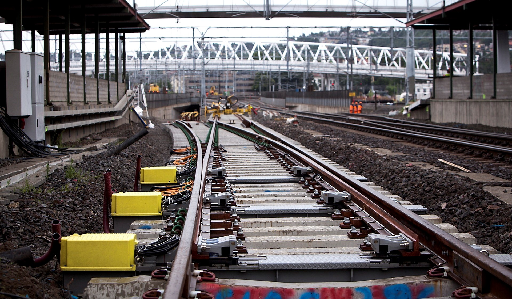

There are two types of delays in railroads; AKV (emergency) and UKV (not so urgent). Based on data collected between Oslo S to Asker + Brobekk from January to May, the visualization below clearly shows that the amount of AKV’s has had a positive turnaround with a tradeoff in UKV’s where there has been fewer AKV’s each and every month in 2017 than earlier.

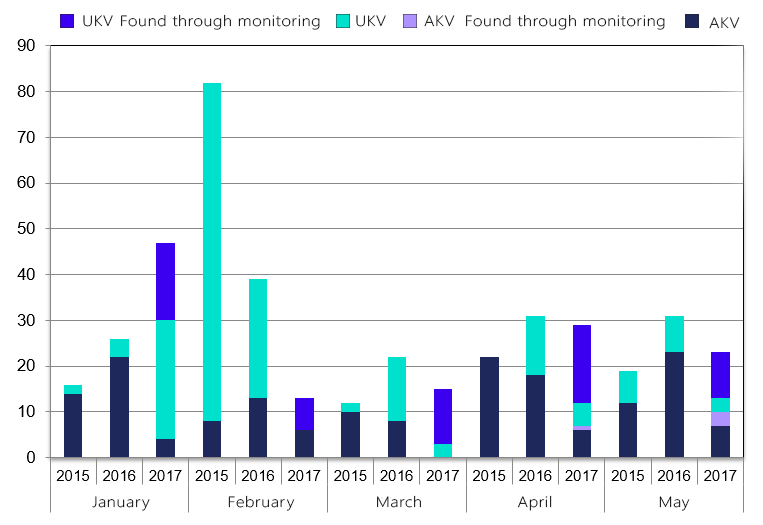

The first point machines were monitored in Q3 2016 where electricity (current/force – measures the magnetic field around the power cord) and time (time taken to perform switch action) was registered from sensors. Based on these two measures, you can see that the monitoring and the base system implementation conducted in 2017 has had a positive impact on AKV and UKV’s. 


**Goals for monitoring:**
- Reduce the number of delay hours
- Gain a tool for operational efficiency
- Warning of errors before it occurs and becomes critical
- Gain a collaborative tool between specialists
- Use of resource/subject expertise
- Condition check of switches without having to physically be at the tracks
- Condition check of switches after conducted maintenance


## Core team


## Customer profile

Bane NOR is a state-owned company responsible for the national railway infrastructure.

Bane NOR's mission is to ensure accessible railway infrastructure and efficient and user-friendly services, including the development of hubs and goods terminals.

The company is responsible for the planning, development, administration, operation, and maintenance of the national railway network, traffic management and administration and development of railway property. Bane NOR has operational coordination responsibility for safety work and operational responsibility for the coordination of emergency preparedness and crisis management.

Bane NOR has approximately 4,500 employees and the head office is based in Oslo, Norway.

## Solution Overview

### Current system

The current implementation is a threshold based system where the maximum capacity of the point machine is taken into consideration and manually set to a maximum value based on the current/force taken to perform a switch. This is because there are clutches inside the point machine that limits the force it can handle. This data has collected both directions (from a left to right switch and vice versa). Sometimes the force is stronger in one specific direction. The reason for this might be that the clutch has been unevenly used and the connection point on the metal creates uneven patterns in the data which results in variations. The minimum mark is also set manually into a table based on the lowest point of a successful switch. These values are manually inserted into a table, and based on these values; a reference curve is recorded for all the point machines in all directions. Every single point machine regardless of direction gets its own reference curve.

Below is a representation of the current system visualizing a switch profile for a point machine.

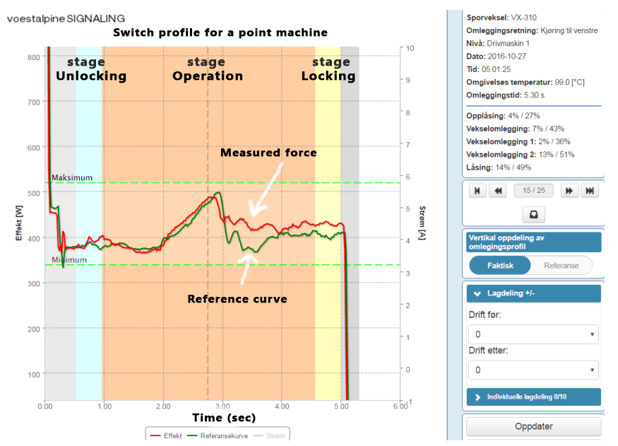

There are multiple stages for a switch profile. 

**Inrush current:** The big spike in the beginning of the profile (uninteresting)

**Unlocking:** The track switch is unlocked because it must be locked either to the right or left to allow a train to pass

**Operation:** The actual movement of the tongue of the point machine
Locking: Locking of the switch so that a train can pass


### How the alarm gets triggered

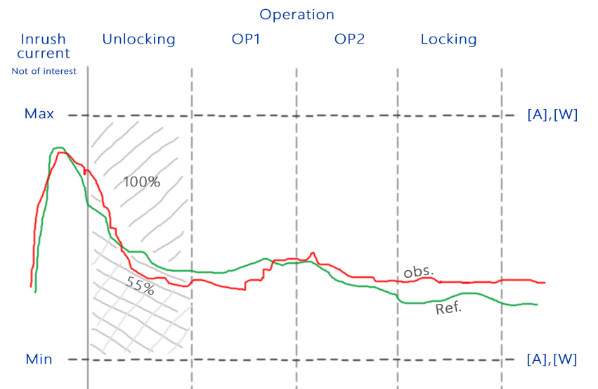

Referenced to the picture above, the area under the curve is bound by the reference line and the wall on the left and right to the previous/next stage. Each divided part has a utilization percentage out of the total 100% of the section to see how much the observation is from the threshold (see ‘Unlocking’). If the variation is too big, the alarm goes off and the monitoring will notify the engineer about a possible error. Based on this information, the only thing the system know is whether the observation has reached its threshold within a stage or not, but not how fast the machine is deteriorating or how fast the area is growing. Three consecutive peaks within a 24 hours time frame will trigger the alarm.

Based on the color of the switch (representing a state), a work order can be so that an engineer conducts some kind of maintenance on the respective switch.


**Summary of the current system:**

- Measurement of current/current vs. time for successful switch
- Measures own state in relation to its defined reference switch profile
- Switch profile curve for each direction of the point machine
- Overview of the total switch operation allows for state check for different phases of the switch
- Overview of total switch operation can be compared to historical measurements


## Technical delivery

Historically, Data Science has long been an individual sport that researchers and statisticians would take on, however, these days it often involves a team of people working together to achieve a specific result or a system that is more like a production system more than just a result. Data Science is about driving decisions, having business impact by being integrated into a loop within a business. Often, these teams are also multi-disciplinary and since the current team working together on this project had different skill level and expertise, we decided to adopt specific parts of the [Microsoft Team Data Science Process](https://docs.microsoft.com/en-us/azure/machine-learning/data-science-process-overview). 

The Team Data Science Process (TDSP) helps you define where you are in the project and what you are trying to achieve. The TDSP framework also consists of multiple templates and standardized documents for project structure and helps to generate consistent high-quality outputs. 


### Day 0 – The data day

The data day was a day where we planned to look at the data (volume, variety, veracity, and velocity) within the data source to become as prepared as we could before the hackfest. The way the data came in was through a Postgres DB located On-Premise at BaneNOR’s facilities. Knowing that we would like to use the power of Machine Learning in the cloud through Azure Machine Learning Studio (AMLS), we knew that creating a direct connection to the DB could potentially be problematic. We decided to make extractions and aggregations of the data prior to the hackfest so that we had specific CSV-files to work with during the execution of the hackfest. 

After having looked at the data, we decided to follow the concept of RFM (Recency, Frequency, Monetary value) extracted from the TDSP framework and brainstormed a set of questions that we wanted to know the answers to. The set of questions we came up with was the following:

- Have the switchers failed recently?
- How many successful switches has the switcher completed?
- How many trains have driven on top of the switcher?
- How long time has the switcher been in production?
- When was the last generic maintenance?
- When was the last actionable maintenance?
- Has the switcher been a good switcher during its life or has it been prone to failures?
- Is the switcher more exposed to bad weather?
- Location of the switcher, is it more exposed? Tunnel? Harsh environment, how is the pitch (angle) of the switcher?
- Who produced the switcher?
- Who implemented the switchers?
- When will the switch fail?

Being able to answer the questions above would already solve a lot of BaneNOR’s challenges. Having a goal of answering all the questions above within the scope of the hackfest, could get comprehensive. We decided that we would make a decision on what to work on during the start of the hackfest.

For now, being able to define the objectives, identifying the data source and understanding the data; was good enough to kick off the hackfest.

### Hackfest kick off

Having conducted a successful data day, we set off to start the hackfest. We revised the current approach that BaneNOR conducts and identified that the [predictive maintenance for an aerospace experiment in AMLS would be a suitable scenario to replicate](https://gallery.cortanaintelligence.com/Solution/Predictive-Maintenance-for-Aerospace-4). This is because BaneNOR would like to calculate the remaining useful life in days (RUL) of the switches, which is based on a regression analysis. Before substituting the data from the sample with our own, we decided to look at other approaches that might give us other information from what we have to work with, which we didn’t know from before. 

On Sunday (one day prior to the hackfest), a switch actually broke down on the Central station in Oslo. We pulled the same switch up on the monitor within the current system and verified that there is data before failure. We found this switch interesting in particular since it had been working for a long time and just recently failed. We decided to focus on this switch to see if we could produce some new information from the data we already had.

The insides of an Alstom point machine from 0 to 50 mm movement:

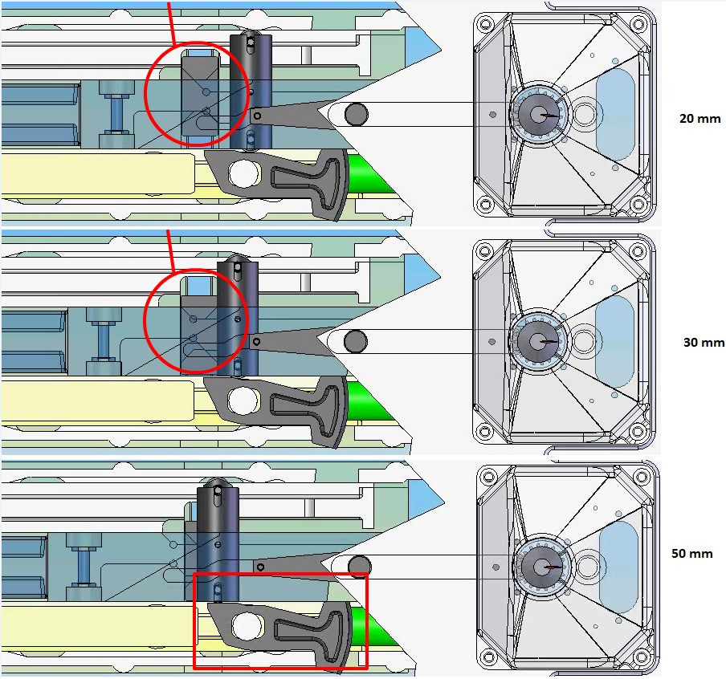

The visualization represents the unlocking stage of the swing where the hammer is being prepared to be released/unlocked.

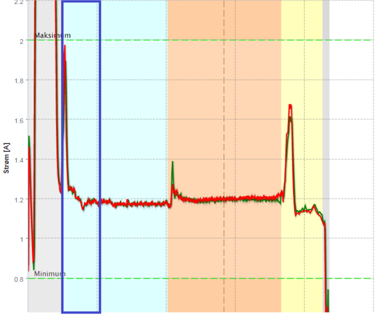

### Residual Sum of Squares exploration

We performed some statistics (Residual Sum of Squares) where we took the error function used in linear regression instead of doing the integral and the difference between the two integrals, we managed to see a magnification in the spikes – spikes that we didn’t know existed from before. We made a significant finding on day 1 of the hackfest. 

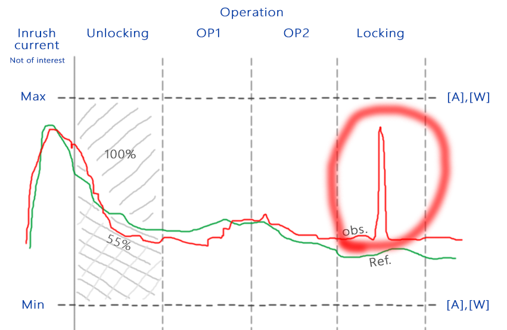

The final spike in the locking section is so thin that it does not trigger the alarm. Whether it was important or not, was something that the current system didn’t notify about as it looked upon it as green at all times. It turned out that we managed to identify a new class which we called “over stroke”. This is a mechanical failure inside the point machine and not the switch (tongue) itself. This is a finding that the current system is unable to detect because it only measures voltages/amps.

If we focus on the locking stage of the specific switch that recently failed with the actual data, we can clearly see that the condition has deteriorated over time.

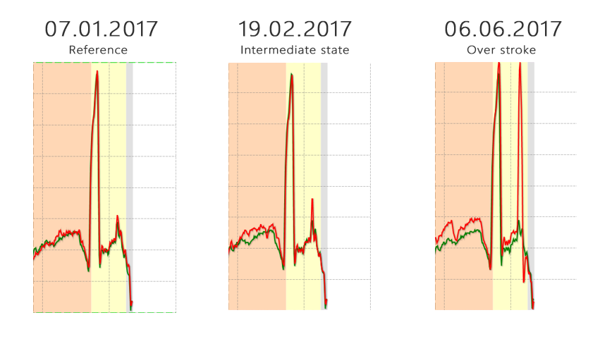

By looking at the findings above, the switch that failed recently; could have been spotted as early as March, three months before it broke down.

To calculate the Sum of Square Differences (SSD), we wrote the following python snippet:


```python
def ssd(A,B):
   squares = (A[:,:,:3] - B[:,:,:3]) ** 2
   return numpy.sum(squares)
```
We got the signature for the electricity where we generated the function that reshaped the pattern to only include the start of the initialization of the switch for the locking phase and the end of the locking phase. We then looked at the reference for that particular switch where we defined a threshold. This reference threshold would be different compared to the observed signature for over stroke. 

We started the reference from 6’th of January and used the intermediate state of 20’th February, and ended the monitoring at the 3’rd of June (which we know has over stroke, but where the switch hasn’t failed yet). 

The threshold for knowing if the switch is suffering from over stroke or not was 0.67. If there is over stroke, the RSS value would be bigger than 0.67.

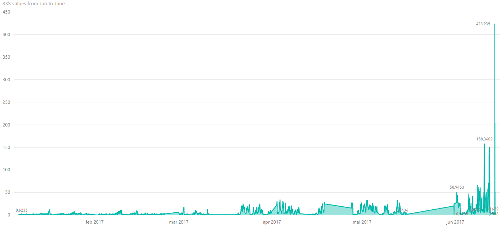

Based on the RSS values from January to June, it is easy to see that the switch has slowly been deteriorating.
The over stroke RSS threshold of 30-50 is the point we know it’s going bad. 

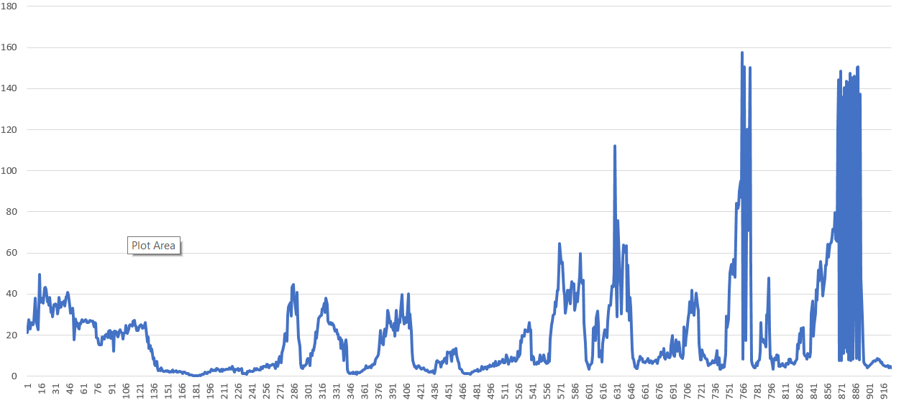

It is worth mentioning that it could be beneficial to perform a moving average to smooth out the peaks, but as a result of this; the slope would decrease.

**The python code for generating the output for the chart above:**


```python
import pandas as pd
import numpy as np

df1 = pd.read_csv('2017-06-13_11-31-47_Oslo-Sentral_VX244b_Left_3_reference.csv')
df2 = pd.read_csv('2017-06-13_11-31-47_Oslo-Sentral_VX244b_Left_3_overstroke.csv')

#df2 = pd.read_csv('2017-06-13_11-31-47_Oslo-Sentral_VX244b_Left_3_NonOverstroke.csv')
dfn1 = np.swapaxes(df1, 0, 1)
dfn2 = np.swapaxes(df2, 0, 1)
dfn1 = dfn1.dropna()
d1 = dfn1.tail(dfn1.shape[0]-9)
dfn2 = dfn2.dropna()
d2 = dfn2.tail(dfn2.shape[0]-9)
minSize = d1.shape[0]

if d2.shape[0] < minSize:
    minSize = d2.shape[0]
    d1 = d1.head(minSize)
else:
    d2 = d2.head(minSize)

diff = (d1.values - d2.values)**2
d = np.sum(diff)

print(d)
```

**Read more about how the Residual Sum of Squares function works in the RSS section.**

### Fourier Transform exploration

After having had success with RSS, we decided to look into vibration to see if we could generate numbers for friction.
One way to transform a signal of time into the frequencies is to decompose it. Fourier Transform (FT) does just this. FT is a baseline algorithm for detection of frequencies. 

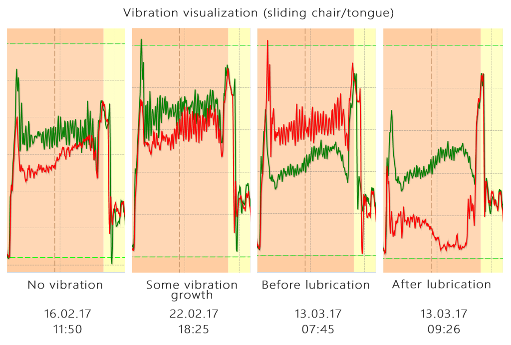

From the visualization above, one can easily spot the vibration pattern evolvement from the measured swing force and confirm that lubrication removes the vibration.

We decided to proceed with the Fast Fourier Transform (FFT) function on a swing from left to right on a particular point machine. FFT computes the discrete Fourier transform (DFT) of a sequence, or its inverse (IFFT) and converts the signal from its original domain to a representation in the frequency domain. We trimmed away the beginning and the end of the swing through some Python code to make sure we select the right timeframe where the actual vibration is generated when the tongue is moving. Since the current project only has one dimension (current), we decided to choose simpler approaches consisting of statistics rather than using complex neural networks. 

Python for the FFT energy metric:


```python
import numpy as np
import pandas as pd
import matplotlib.pyplot as plot
import scipy.fftpack
fullCSV = pd.read_csv('2017-06-14_13-27-29_Oslo-Sentral_OSVX296a_Right_2.csv')
for index, row in fullCSV.iterrows():
    row =  row[220:370]
    #print(row)
    dfn2 = row.dropna()
    Y = np.fft.fft(row)
    #print('y')
    #print(Y)
    #print(Y[2].real, Y[2].imag)
    # freq = np.fft.fftfreq(len(switchSignal), t[1] - t[0])
    freq = np.fft.fftfreq(row.shape[0], 0.01)
    #print(type(freq))
    
    print(len(Y))
    
    yleft = Y[0:60]
    yright = Y[90:150]
    
    freqleft = freq[0:60]
    freqright = freq[90:150]
    
    freq[60:90] = 0
    
    freqprime = freqleft + freqright
    
    #chart  = plot.figure()
    #ax = chart.add_subplot(111)
    #ax.plot(row, color = 'blue', linewidth = 3)
    #plt.show()
    plot.figure()
    plot.plot( freq, np.abs(Y) )
    #plt.figure()
    #plt.plot(freq, np.angle(Y) )
    plot.show()

```

Good results on the FFT energy metric over time showing lubrication removes the vibration (friction):

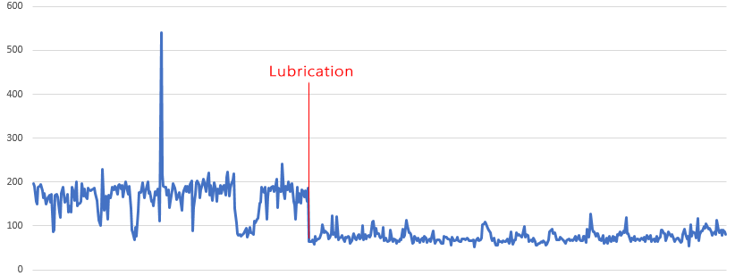

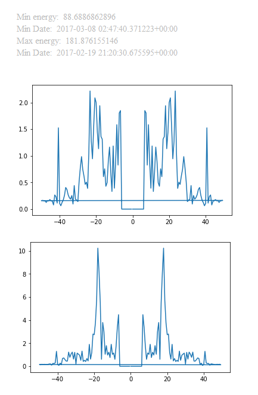

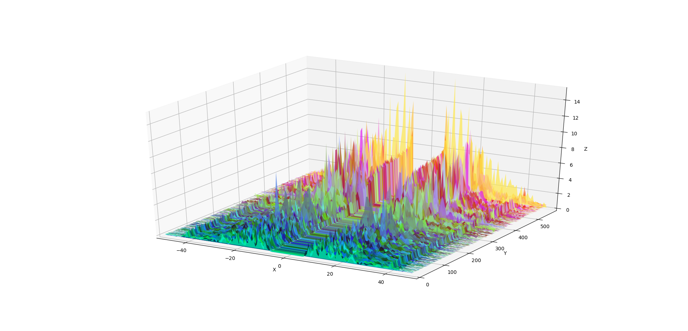

The following code was written in order to produce the visualizations above:

```python
import numpy as np
import pandas as pd
import scipy.fftpack
from mpl_toolkits.mplot3d import Axes3D
from matplotlib.collections import PolyCollection
import matplotlib.pyplot as plt
from matplotlib import colors as mcolors
import random

import sys
import os
import csv


rss = {}

measurements = list()


def createHighPassFFT(fullCSV):
    minEnergy = 1000.0
    maxEnergy = 0.0


    for index, row in fullCSV.iterrows():

        date = row[0]
        row = row[220:370]
        # print(row)
        dfn2 = row.dropna()
        Y = np.fft.fft(row)
        # print('y')
        # print(Y)
        # print(Y[2].real, Y[2].imag)
        # freq = np.fft.fftfreq(len(switchSignal), t[1] - t[0])
        freq = np.fft.fftfreq(row.shape[0], 0.01)
        # print(type(freq))

        # print(len(Y))
        # print(len(freq))
        # print(freq)
        # print(" Y:")
        # print(", ".join("%.2f" % f for f in np.abs(Y)))
        Y[0:10] = 0
        Y[141:150] = 0
        totalEnergy = np.sum(np.abs(Y))

        measurements.append(list(zip(freq, np.abs(Y))))

        # print("Total = ", totalEnergy)
        rss[date] = totalEnergy
        if totalEnergy < minEnergy:
            minEnergy = totalEnergy
            minY = Y
            minDate = date
            minFreq = freq

        if totalEnergy > maxEnergy:
            maxEnergy = totalEnergy
            maxY = Y
            maxDate = date
            maxFreq = freq
           
    print("Min energy: ", minEnergy)
    print("Min Date: ", minDate)
    fig = plt.figure()
    plt.plot(minFreq, np.abs(minY))

    print("Max energy: ", maxEnergy)
    print("Min Date: ", maxDate)
    fig = plt.figure()
    plt.plot(maxFreq, np.abs(maxY))
    # plt.figure()
    # plt.plot(freq, np.angle(Y) )
    plt.show()

    return measurements

def PlotDateSeries2D( measurements, title, xLabel, yLabel):
    fig = plt.figure()
    plt.title(title)
    plt.xlabel(xLabel)
    plt.ylabel(yLabel)
    print(measurements.shape)
    print(measurements)
    plt.plot(measurements)

def PlotDataFrame(df):
    plt.figure()
    df.plot.area(stacked=False);
    plt.show()


def Plot3DMultipleMeasurements(df):
    fig = plt.figure()


    verts = []
    facecolors = []

    print(df.columns.values)
    minY = sys.float_info.max
    maxY = sys.float_info.min

    maxX = sys.float_info.max
    #Get first column as Z axis
    dates = df.iloc[:,[0]]
    zs = np.arange(0, len(df.columns)-1)
    xs = np.arange(0, len(df.index))
    print(zs)
    print(xs)
    columns = df.columns
    mask = np.ones(columns.shape, dtype=bool)
    mask[0] = 0
    df = df[columns[mask]]

    for column in df:
        measurement = df[column].values
        currMinY = min(measurement)
        currMaxY = max(measurement)
        if minY > currMinY:
            minY = currMinY
        if maxY < currMaxY:
            maxY = currMaxY

        currMaxX = len(measurement)
        if maxX < currMaxX:
            maxX = currMaxX
        print(minY)

    ax = fig.add_subplot(111, projection='3d')
    # ax.set_xlabel('X')
    # ax.set_xlim3d(0, len(df.index))
    # ax.set_ylabel('Y')
    # ax.set_ylim3d(0, len(zs))
    # ax.set_zlabel('Z')
    # ax.set_zlim3d(minY, maxY)

    count = 0
    for column in df:
        measurement = df[column].values

        r = random.uniform(0, 1)
        g = random.uniform(0, 1)
        b = random.uniform(0, 1)
        a = 0.6
        facecolor = (r, g, b, a)
        facecolors.append(facecolor)

        count = count + 1
        print("Column name: ", column)
        ax.plot( xs, [count]*len(measurement), measurement, label=column)

    for angle in range(0, 360):
        ax.view_init(30, angle)
        plt.draw()
        plt.pause(.001)
    plt.show()


def cc(arg):
    return mcolors.to_rgba(arg, alpha=0.6)

print(os.getcwd())

frictionCSV = pd.read_csv('FrictionVX317-2-Left-rss.csv', header=0)

# measurements = frictionCSV.iloc[:, [0,1]].values
# print(measurements)
Plot3DMultipleMeasurements(frictionCSV.iloc[:,:5])
Plot3DMultipleMeasurements(frictionCSV)

# PlotDataFrame(measurements)
# PlotDataFrame(frictionCSV)
# PlotDateSeries2D(measurements, "Friction 317-2-Left", "Date", "RSS(Watts)" )

# vibrationCSV = pd.read_csv('2017-06-15_10-06-16_Oslo-Sentral_OSVX296a_Right_2.csv')
# measurements = createHighPassFFT(vibrationCSV)
# measurements = sorted(measurements)
#

# with open('2017-06-15_10-06-16_Oslo-Sentral_OSVX296a_Right_2Vibration.csv', 'w',
#           newline='') as f:  # Just use 'w' mode in 3.x
#     w = csv.writer(f)
#     w.writerows(sorted(rss.items()))
```

**Read more about how the Fourier Transform function works in the FFT section.**

## Residual Sum of Squares (RSS)

In this section, we will be looking at the concepts and the relationships between the Total Sum of Squares (TSS), Explained Sum of Squares (ESS) and the Residual Sum of Squares (RSS).

If we imagine us having some kind of data for two variables (Xi)(Yi), the Yi dimension is going to be the measure we will try to explain with our model. If we calculate the mean for the Yi, it would look something like this:

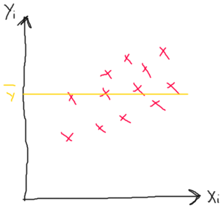

If we think about the total amount of variance in our dependent variable that we are trying to explain, as being the sum of all the vertical distances of the plotted data points from the mean of Yi which is called the Y-bar. Since we also have some points that are going to be below Y-bar, we will not only sum the distances, but we will sum the square of the distances so that the sum from i equal 1 to N of Yi minus the mean (Y-bar) all squared. This equation represents the amount of variance in our dependent variable which we are trying to explain (so-called Total Sum of Squares = TTS). The TTS will explain why our dependent variable Y varies.

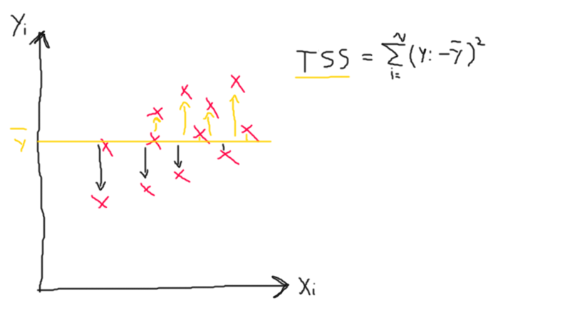

If we fit our linear model to our data, the fitted line might look something like this:

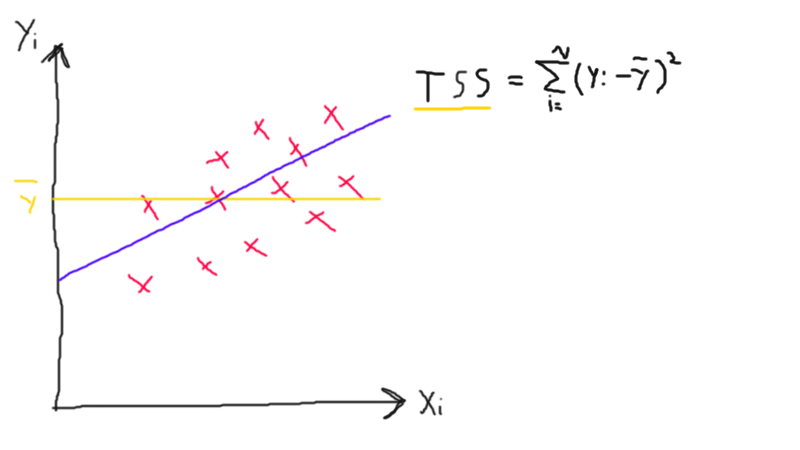

For each value of Xi, our model suggests a value Yi which isn’t identical to our value which we already have plotted in the example above.

Based on the model that we have created above, how much variation is there from the Y point from the Y-bar (mean) that is explained by our fitted model. We can get to know this by summing up from I equal 1 to N, our predicted values of Yi (the fitted plots) minus Y-bar all squared. This equation is called Explained Sum of Squares (ESS) because this is the amount of variation in Y which our model explains.

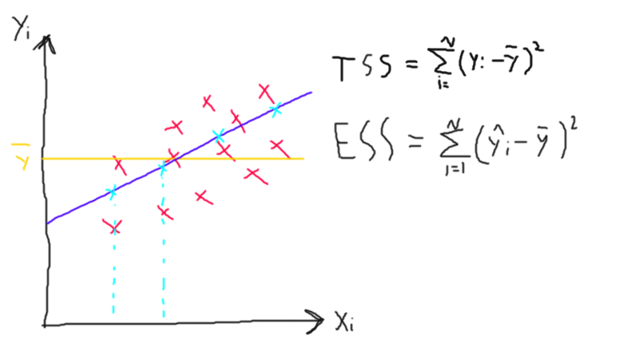

In reality, however, it’s not often the case that the ESS is the same as the TSS. In order for this to be the case, the model in my example would have to be fitted to each of the points absolutely perfect. Aside from the fact that, that would probably overfit the data (read more about overfitting), it is very unlikely that the ESS would be the same as the TSS. In reality, the ESS is less than the TSS. The Ration between ESS and TSS is somewhat less than 1. The reason for this is because there is almost always a difference between our true values of Y and our fitted values of Y, which I have illustrated in the chart below (the difference between the line (fitted) and the true value (Y)). This is called the Residual Sum of Squares (RSS) because it’s the amount that is left over after the model has tried to explain the data. It is essentially the deviations predicted from actual empirical values of data which is what we used for the hackfest to gain more insight from the data.

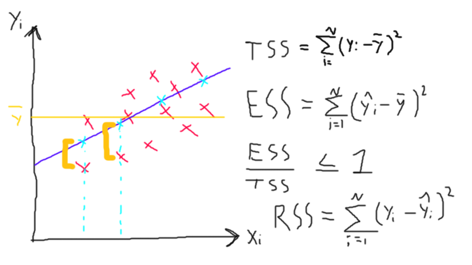

Below, a single explanatory variable is given by the following equation:


where yi is the i th value of the variable to be predicted, xi is the i th value of the explanatory variable, and   is the predicted value of yi (also termed ) (Wikipedia 2013).

## Fast Fourier Transform (FFT)

In this section, we are going to look at the Fast Fourier Transform (FFT). The FFT is simply just a different way of looking at a signal. For instance, on an oscilloscope, you tend to look at voltage changing over time; an FFT example shows you instead what voltages are present at each frequency. If you imagine a signal as a bunch of wire tangled together, the FFT will help you to untangle the mess, see what it’s made off and see what components are lurking in that signal. If you have a representation of a sine-wave, it would be represented in the FFT by one spike as shown below (because there is one frequency):

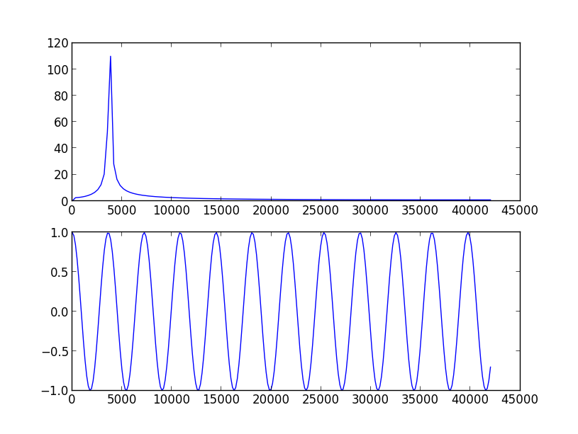

But if you plug it in the oscilloscope, what you would actually see is a second spike. And you wouldn’t be able to see that in the sine-wave because it is very low level, it is such a minuscule second signal that you have to have something like the FFT to bring it out. 

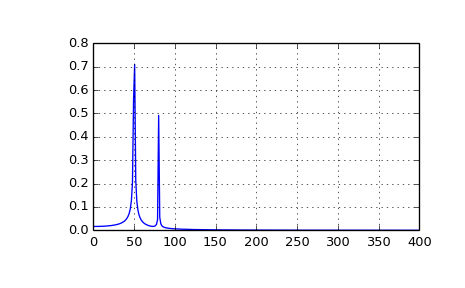

This is exactly what we used the FFT for as based on the energy (force), we used FFT to look for vibration. When maintenance was performed, we simply saw lower spikes because there was less friction which in return yielded less force requirements for the tongue to make a proper switch.

The DFT (Discrete Fourier Transform) is obtained by decomposing a sequence of values into components of different frequencies. This operation is useful in many scenarios but computing it directly from the definition is often too slow to be practical. An FFT is a way to compute the same result more quickly. An FFT algorithm computes the DFT of a sequence, or its inverse (IFFT) (Wikipedia 2002).

[Jeremy Kun has a great article about the Fast Fourier Transform and how you can implement your own through some Python code.](https://jeremykun.com/2012/07/18/the-fast-fourier-transform/)

For this hackfest, we leveraged the FFT-Pack from SciPy.
Here is an example of the implementation:

```python
from scipy.fftpack import fft
x = np.array([1.0, 2.0, 1.0, -1.0, 1.5])
y = fft(x)
y
```
The output would then be:
```python
array([ 4.50000000+0.j        ,  2.08155948-1.65109876j,
       -1.83155948+1.60822041j, -1.83155948-1.60822041j,
        2.08155948+1.65109876j])
```

## Conclusion

Predictive maintenance encompasses a variety of topics, including but not limited to failure prediction, failure diagnosis (root cause analysis), failure detection, failure type classification, and recommendation of mitigation or maintenance actions after failure. After this hackfest, BaneNOR is definitely getting closer to predictive maintenance from being in the reactive maintenance zone. BaneNOR’s dream is to be able to foresee how many actions a switch has left until it fails. Even though we didn’t get there, the hackfest has ascended the current protocol to take use of smarter techniques and gain more information from the data that they already have. The existing system will gain much intelligence from implementing the methods that were yielded from this hackfest. 

We were lucky that a switch failed recently. On the flipside of things, we decided to use this specific switch as the basis for our analysis and started digging into its data. It turned out that, based on the statistical techniques used (RSS), we figured that this switched could have been saved as early as March (if this technique was implemented in the existing system); three full months before the switch actually failed. Not only did this confirm the theory of predictive maintenance through the use of RSS in the specific scenario, it actually identified a new type of class (failure) called “over stroke”. Over stroke is a mechanical failure inside the point machine and not the switch tongue itself. One of those things that the current system cannot detect because it only measures voltage/amps and validates the observation versus the covered area based on the maximum/minimum values.

Another success to this endeavor was the use of FFT on the energy to transform it into another representation; vibration/friction. Based on the FFT chart, it was easy to see that when maintenance was conducted on a particular switch, the vibration decreased significantly; proving that injecting oil and other fluids to smooth the point machine actually reduces friction thus requiring less energy to move. 

Even though there weren’t that much machine learning involved in the findings above, BaneNOR is still keen to leverage tools like Azure Machine Learning Studio (AMLS) to achieve their goal of identifying the Remaining Useful Life (RUL) for a switch. BaneNOR has gotten a proper introduction to the tool and has already started to experiment with existing experiments in the Cortana Intelligence Gallery that are suitable for their own scenario. Based on the template, BaneNOR are not far away from being able to insert their own data into the tool and leveraging the existing template for their own purpose.

The hackfest has definitely expanded BaneNOR’s horizon. BaneNOR now has a much larger perspective on what can be achieved, what opportunities there are and where they want to go. 


## Going forward

BaneNOR will keep on expanding their knowledge on Machine Learning as well as looking at other potential methods of gaining more information from their data. High up on the roadmap for BaneNOR, is the goal of using AMLS to extract more information out of their current data sources, create a predictive model that can calculate the RUL for all of the switches and not only one switch in particular, like we did for the PoC. BaneNOR has an objective of running the current model on all of the switches and find at least one switch that needs service which the current system doesn’t find. Based on this information a work order can be sent out to an engineer. A fully connected production system is therefore not far away from the future pipeline, and BaneNOR and Microsoft are happy with the outcomes of the week-long hackfest and looks forward to similar collaborations. 
## Additional resources

[Read more about overfitting](https://en.wikipedia.org/wiki/Overfitting)

[Article about the Fast Fourier Transform](https://jeremykun.com/2012/07/18/the-fast-fourier-transform/)

[Predictive maintenance for aerospace experiment in AMLS](https://gallery.cortanaintelligence.com/Solution/Predictive-Maintenance-for-Aerospace-4)


## Referencese

Dataconomy. 2015. PREDICTIVE MAINTENANCE: BIG DATA ON RAILS. http://dataconomy.com/2015/04/predictive-maintenance-big-data-on-rails/.

IBM. 2015. "Predictive maintenance benefits for the railway industry." IBM Travel & Transportation Industry 1-4.

Wikipedia. 2002. Fast Fourier Transform. https://en.wikipedia.org/wiki/Fast_Fourier_transform.
—. 2013. RSS. https://en.wikipedia.org/wiki/Residual_sum_of_squares.
